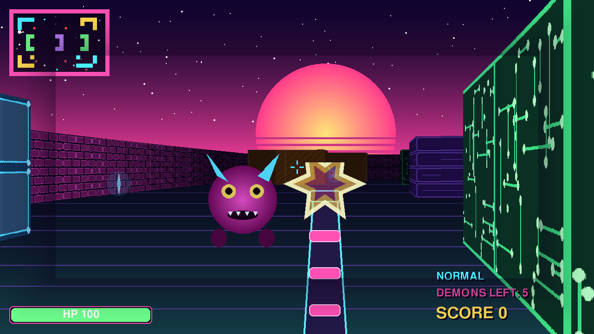

> **Игра, созданная с ИИ с одного промта.**
> **Тест 1:** игра «NEON DOOM» - неоновый псевдо-3D шутер с честным рейкастингом в духе классики, на чистом Python + pygame. Вся графика и звук синтезируются кодом, ассетов ноль.

NEON DOOM
=========

Олдскульный шутер от первого лица, только не коричнево-серый, а неоновый.
Писал в свободное время, потому что давно хотелось разобратся, как работали
движки начала девяностых — когда никаких видеокарт ещё не было, а по экрану
уже бегали монстры. Оказалось, что всё держится на одной идее: пускаем из
глаза игрока луч на каждый столбец экрана и смотрим, где он воткнётся в стену.
Дальше просто рисуем вертикальную полоску нужной высоты.

Никаких готовых игровых движков тут нет, только Python и pygame для вывода
пикселей на экран. Картинок в проекте тоже нет — все текстуры, демоны, пушка
и даже звуки рисуются и синтезируются кодом при старте. Сначала я хотел
накидать png-шек, но потом подумал: а зачем, если стену из кирпича можно
нарисовать двумя циклами.

Как запустить
-------------

Нужен Python 3.8 или новее и pygame. Ставить руками ничего не обязательно —
на Windows об этом позаботится скрипт.

**Windows, в один клик**

1. Скачайте папку с проектом и распакуйте её куда угодно, хоть на рабочий стол.
   Важно только распаковать: запускать прямо из архива не выйдет.
2. Зайдите в папку и дважды кликните по `PLAY.bat`.
3. Откроется чёрное окно консоли. Первый запуск идёт примерно полминуты:
   скрипт ищет Python, при необходимости ставит его через winget, затем
   докачивает pygame (около 10 МБ). Всё это он пишет на экран, так что видно,
   на каком он шаге.
4. Когда появится строчка «Запускаю. Приятной игры!», откроется окно игры.
   Консоль не закрывайте, она нужна пока игра запущена.
5. В меню нажмите Enter — и вперёд.

Со второго раза игра стартует сразу, ставить уже нечего.

Вместо `PLAY.bat` можно кликнуть правой кнопкой по `run.ps1` и выбрать
«Выполнить с помощью PowerShell» — результат тот же. `PLAY.bat` это просто
обёртка, которая зовёт тот же скрипт и заодно обходит запрет на выполнение
скриптов, если он у вас включён.

**Linux и macOS**

Тут всё вручную, зато привычно:

    python3 -m pip install -r requirements.txt
    python3 main.py

Под Linux pygame иногда просит системные библиотеки SDL2, если их нет:

    sudo apt install python3-pygame     # Debian, Ubuntu
    brew install sdl2                   # macOS, если ставите pygame из исходников

**Если что-то пошло не так**

Важно: скрипты нужно именно запускать файлом, а не копировать их текст в
открытое окно PowerShell. При копипасте скрипт не знает, где он лежит, и
начнёт работать в той папке, которая открыта в консоли. Двойной клик по
`PLAY.bat` или правый клик по `run.ps1` — правильный способ.

Окно консоли моргнуло и закрылось — запустите `run.ps1` через правый клик,
тогда текст ошибки останется на экране. Скрипт специально ждёт нажатия Enter
перед закрытием, если что-то упало.

«Выполнение сценариев отключено в этой системе» — вы запустили `run.ps1`
напрямую из PowerShell. Либо запускайте через `PLAY.bat`, либо разрешите
скрипты на одну сессию:

    Set-ExecutionPolicy -Scope Process Bypass

Windows ругается на неизвестного издателя — это обычное предупреждение
SmartScreen для скачанных файлов, жмите «Подробнее» и «Выполнить в любом случае».

`python не является внутренней или внешней командой` — Python есть, но не
прописан в PATH. Проще всего переустановить его с официального сайта и на
первом экране установщика поставить галочку «Add Python to PATH».

Нет звука — не страшно, игра это переживает. Звук синтезируется через
`pygame.mixer`, и если звуковое устройство недоступно, игра просто идёт молча.

Управление
----------

    W A S D      ходить
    мышь         крутить головой (стрелки тоже работают)
    ЛКМ, пробел  стрелять
    Shift        бежать
    1 2 3        сложность в меню
    Enter        начать
    R            переиграть
    Esc          в меню и на выход

Задача простая: перебить всех демонов на уровне. Синие кристаллы дают очки,
аптечки лечат. На экране после смерти или победы показывается точность
стрельбы и время — можно соревноваться с самим собой.

Демоны трёх видов и ведут себя по разному. Здоровяк медленный, но бьёт
больно и живучий. Сталкер быстрый и наглый, зато дохнет с двух выстрелов.
Имп посередине. Все они видят игрока только по прямой: если между вами стена,
вас не заметят, по этому из-за угла воевать заметно легче.

Как оно устроено
----------------

Каждый кадр движок пускает 640 лучей (по одному на два пикселя ширины) и
шагает ими по сетке карты алгоритмом DDA — то есть прыгает сразу к следующей
границе клетки, а не ползёт мелкими шажками. Как только луч попал в стену,
считаем расстояние, из него высоту полоски на экране, и берём из текстуры
нужный столбец. Расстояние ещё умножается на косинус угла между лучом и
взглядом, иначе стены по краям экрана выгибаются бочкой — это классический
фишай, его все ловят на первом раскастере.

Туман сделан не честным затемнением каждого столбца, а заранее: на старте
для каждой текстуры печётся дюжина копий разной яркости, и в кадре остаётся
только выбрать нужную. Разница ощутимая — раньше на каждый кадр приходилось
640 операций заливки, теперь ноль. Это ускорило рендер примерно на треть.

Монстры и предметы — обычные спрайты-биллборды, которые всегда повёрнуты к
игроку лицом. Их и стены складывают в один список и рисуют от дальнего к
ближнему (алгоритм художника), поэтому демон корректно прячется за стеной.

Стрельба — hitscan: берём глубину центрального луча и считаем, что попасть
можно только в того, кто ближе этой стены и попадает в перекрестье. Никаких
летящих пуль, всё как в 93-м.

Файлы разложены по смыслу:

    main.py         игровой цикл и состояния (меню, игра, смерть, победа)
    settings.py     все константы в одном месте, крутить balance тут
    map.py          карта уровня нарисована ASCII-символами
    player.py       движение, коллизии, здоровье
    raycasting.py   собственно raycasting
    renderer.py     небо, пол, интерфейс, миникарта, экраны
    graphics.py     генерация всей графики кодом
    sprites.py      демоны с их ИИ и предметы
    weapon.py       бластер
    sounds.py       синтезатор звука
    tests/          headless-тест, гоняет игру без окна

Карту можно поменять прямо в `map.py`, она там лежит списком строк: цифры это
стены с разными текстурами, `E` демон, `H` аптечка, `G` кристалл. Размер
любой, лишь бы строки были одинаковой длины и по краям стояли стены.

Тест запускается так (окно не открывается, рисует в пустоту):

    SDL_VIDEODRIVER=dummy SDL_AUDIODRIVER=dummy python tests/smoke_test.py

Он проходит меню, стреляет, проверяет что игрок не проходит сквозь стены,
убивает всех демонов, ловит экран смерти и заодно обновляет скриншот выше.

Чего пока нет
-------------

Уровень один. Дверей нет, лифтов нет, вертикали нет вообще — как и в
оригинале, впрочем. Патроны бесконечные, я пробовал ограничить, но играть
стало скучнее. Музыки нет, только эффекты. Сохранений и таблицы рекордов
тоже нет.

Если руки дойдут — сделаю второй уровень и босса.

Лицензия
--------

MIT. Берите код, ломайте, переделывайте, спрашивать не нужно.

RustamChu, 2026
